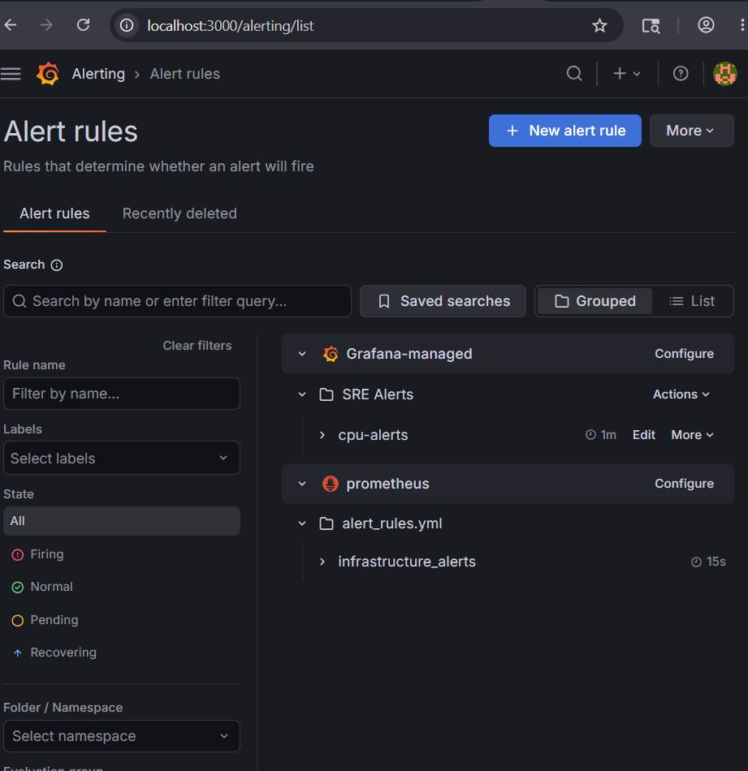

# SRE Monitoring Platform

A real-time infrastructure monitoring stack built with Prometheus, Grafana, and Alertmanager to track system health and trigger alerts on threshold breaches.

## Stack

| Tool | Purpose | Port |
|------|---------|------|
| Prometheus | Metrics scraping & storage | 9090 |
| Grafana | Dashboards & visualization | 3000 |
| Alertmanager | Alert routing & silencing | 9093 |
| Windows Exporter | Host CPU/memory/disk metrics | 9182 |

## Features
- Real-time CPU and memory usage monitoring
- Alerting when CPU > 80% or memory > 85%
- Custom Grafana dashboards for infrastructure health
- Alert routing via Alertmanager
- Prometheus scraping metrics every 15 seconds

## Alert Rules

| Alert | Condition | Severity |
|-------|-----------|----------|
| High CPU Usage Alert | CPU > 80% for 1 min | Warning |
| High Memory Usage Alert | Memory > 85% for 1 min | Critical |

## Dashboard Preview


## Alerts Preview


## How to Run

### Prerequisites
- Prometheus
- Grafana
- Alertmanager
- Windows Exporter

### Steps
1. Start Prometheus:
```bash
.\prometheus.exe --config.file=prometheus.yml
```
2. Start Alertmanager:
```bash
.\alertmanager.exe --config.file=alertmanager.yml
```
3. Open Grafana at `http://localhost:3000`
4. Import dashboard and add Prometheus data source

## Access (Run Locally)
> All services run locally after setup. Use the following default ports:
- **Grafana** → `http://localhost:3000` (admin / admin123)
- **Prometheus** → `http://localhost:9090`
- **Alertmanager** → `http://localhost:9093`
- **Windows Exporter** → `http://localhost:9182/metrics`

## Tech Stack
`Prometheus` `Grafana` `Alertmanager` `Windows Exporter` `PromQL` `YAML`