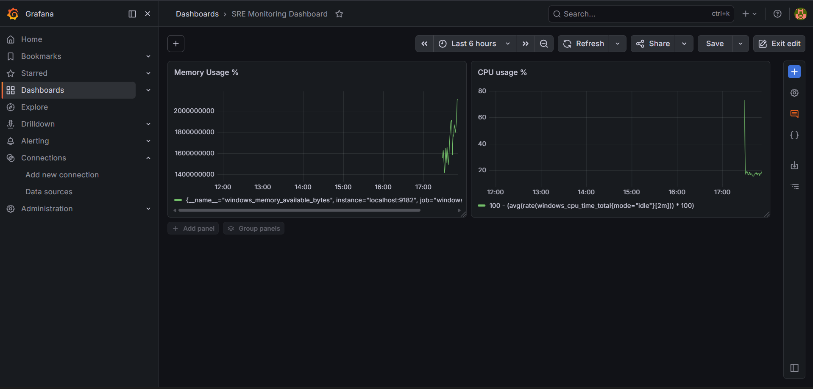

# SRE Monitoring Platform

A real-time infrastructure monitoring stack built with Prometheus, Grafana, and Alertmanager to track system health and trigger alerts on threshold breaches.

## Stack

| Tool | Purpose | Port |
|------|---------|------|
| Prometheus | Metrics scraping & storage | 9090 |
| Grafana | Dashboards & visualization | 3000 |
| Alertmanager | Alert routing & silencing | 9093 |
| Windows Exporter | Host CPU/memory/disk metrics | 9182 |

## Features
- Real-time CPU and memory usage monitoring
- Alerting when CPU > 80% or memory > 85%
- Custom Grafana dashboards for infrastructure health
- Alert routing via Alertmanager

## Alert Rules
| Alert | Condition | Severity |
|-------|-----------|----------|
| HighCPUUsage | CPU > 80% for 2 min | Warning |
| HighMemoryUsage | Memory > 85% for 2 min | Critical |
| ServiceDown | Target unreachable for 1 min | Critical |

## Tech Stack
Prometheus | Grafana | Alertmanager | Windows Exporter | PromQL | YAML
## Dashboard Preview
